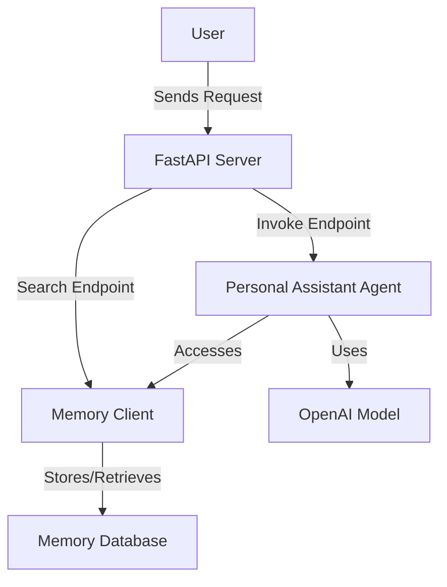

# Strands + Bedrock AgentCore Memory App

## Overview

This application is designed to function as a personal assistant, leveraging memory storage and retrieval to provide context-aware responses. It utilizes FastAPI to expose endpoints for invoking the assistant and searching memories. The core components include:

- **Personal Assistant Agent**: Handles user prompts and provides responses using OpenAI's models.
- **Memory Management**: Stores and retrieves user interactions to enhance response accuracy and relevance.

## How to Run

### Prerequisites

- Python 3.8+
- FastAPI
- Uvicorn
- OpenAI API Key

### Installation

1. Clone the repository:
   ```bash
   git clone https://github.com/ramsrk7/Strands-Agent.git
   cd Strands-Agent
   ```

2. Install the required packages:
   ```bash
   pip install -r requirements.txt
   ```

### Running the Application

To start the application, run the following command:

```bash
uvicorn app.main:app --host 0.0.0.0 --port 8008 --reload
```

This will start the FastAPI server on port 8008.

## API Endpoints

### Invoke the Personal Assistant

- **Endpoint**: `/invoke`
- **Method**: POST
- **Request Body**:
  ```json
  {
    "user_id": "string",
    "prompt": "string",
    "session_id": "string (optional)",
    "use_long_term": true,
    "use_hooks": false,
    "long_term_top_k": 5
  }
  ```
- **Response**:
  ```json
  {
    "memory_id": "string",
    "actor_id": "string",
    "session_id": "string",
    "result_text": "string",
    "debug": {}
  }
  ```

### Search Memories

- **Endpoint**: `/memories/search`
- **Method**: POST
- **Request Body**:
  ```json
  {
    "user_id": "string",
    "query": "string",
    "scope": "profile or session",
    "session_id": "string (required if scope is session)"
  }
  ```
- **Response**:
  ```json
  {
    "memory_id": "string",
    "actor_id": "string",
    "namespace": "string",
    "hits": "any"
  }
  ```

## Memory Storage and Access

Memory is managed using a client that ensures memory is initialized and accessible. The application supports both short-term and long-term memory storage, with options to use hooks for automatic memory management.

## Architecture



## Configuration

The application requires configuration for API keys and other settings, which are managed in the `config.py` file.
